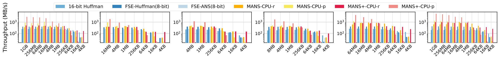
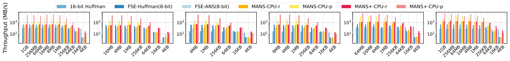
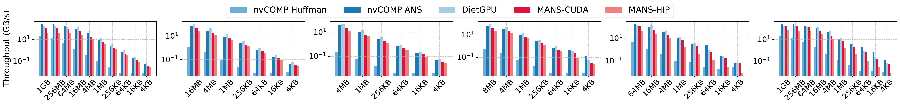
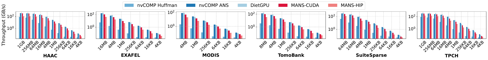
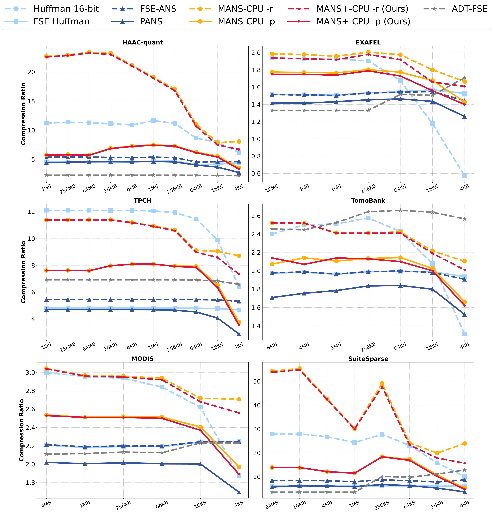

# 📦 PhotonZip

PhotonZip is a tensor-first Python wrapper around vendored lossless codecs.

The current backend is [MANS](https://github.com/hpdps-group/MANS), exposed through a small high-level API:

- `photonzip.compress(...)`
- `photonzip.decompress(...)`
- `photonzip.codec.mans.autotune(...)`

Internally, the Python layer is DLPack-based, and `decompress(...)` returns a `PhotonZipArray`.


## 🔧 Install
**Clone the repo with submodules:**
```bash
git clone --recurse-submodules https://github.com/hpdps-group/PhotonZip.git
cd PhotonZip
```

If you already cloned without submodules:

```bash
git submodule update --init --recursive
```

**Pip install:**

```bash
python3 -m pip install .
```

For local development:

```bash
python3 -m pip install -e . --no-deps
```

## 📋 Environment Setup


```bash
conda create -n photonzip python=3.12 pytorch::pytorch pytorch::pytorch-cuda=12.1 -c pytorch -c conda-forge
conda activate photonzip
```


## 🧪 Usage
```bash
cd examples/MANS
python autotune_to_csv.py
python cpu_roundtrip_autotune.py
python nv_roundtrip.py
```
Expected output see [here](./examples/MANS/README.md).


More examples are available in [`examples`](./examples).

## 📊 Performance

### CPU Compression Throughput



### CPU Decompression Throughput


### NV Compression Throughput



### NV Decompression Throughput



### Compression Ratio



## 🧾 Citation


- [MANS](https://doi.org/10.1145/3712285.3759825)

## 🕰️ History

- `2026-04-12`: Add HDF5 Python support for MANS.
- `2026-04-03`: Integrated MANS CPU and GPU paths into the tensor-first Python framework。


<!-- ## ✅ Tests

Run:

```bash
pytest -q tests/python/test_codecs.py
``` -->
