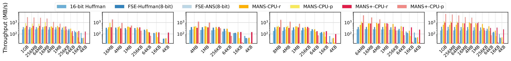
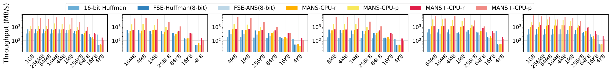
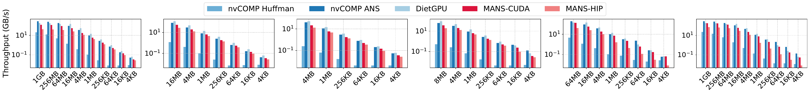
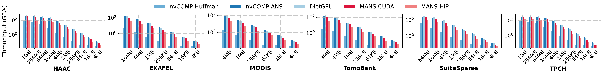
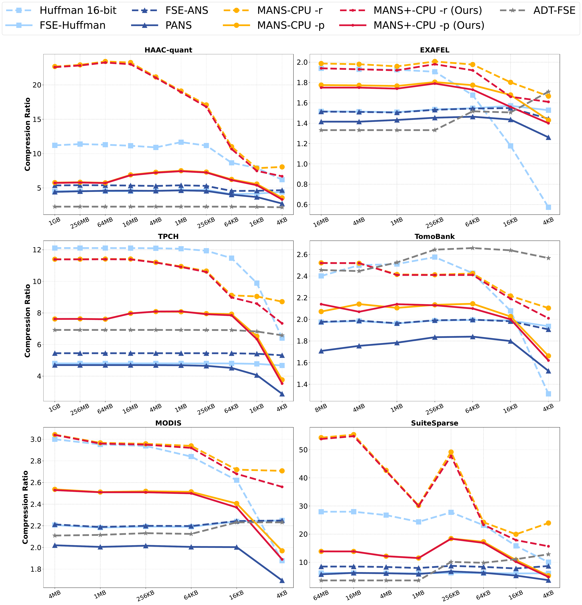

# 📦 PhotonZip

PhotonZip is a tensor-first Python wrapper around vendored lossless codecs.

The current backend is [MANS](https://github.com/hpdps-group/MANS), exposed through a small high-level API:

- `photonzip.compress(...)`
- `photonzip.decompress(...)`
- `photonzip.codec.mans.autotune(...)`

Internally, the Python layer is DLPack-based, and `decompress(...)` returns a `PhotonZipArray`.


## 🔧 Install
**Clone the repo with submodules:**
```bash
git clone --recurse-submodules https://github.com/hpdps-group/PhotonZip.git
cd PhotonZip
```

If you already cloned without submodules:

```bash
git submodule update --init --recursive
```

**Pip install:**

```bash
python3 -m pip install .
```

For local development:

```bash
python3 -m pip install -e . --no-deps
```

## 📋 Environment Setup


```bash
conda create -n photonzip python=3.12 pytorch::pytorch pytorch::pytorch-cuda=12.1 -c pytorch -c conda-forge
conda activate photonzip
```


## 🧪 Usage

### CPU Compress
#### high throughtput
```bash
python examples/photonzip_cli.py \
  --mode compress \
  --input testdata/u2/sfc-gi/sfc-gi_127x127x127_4096kB.u2 \
  --output /tmp/photonzip_cpu.pzc \
  --dims 127 127 127 \
  --dtype uint16 \
  --backend cpu \
  --quality-level lossless \
  --throughput-level high
```
#### high compression ratio
```bash
python examples/photonzip_cli.py \
  --mode compress \
  --input testdata/u2/sfc-gi/sfc-gi_127x127x127_4096kB.u2 \
  --output /tmp/photonzip_cpu.pzc \
  --dims 127 127 127 \
  --dtype uint16 \
  --backend cpu \
  --quality-level lossless \
  --ratio-level high
```
### CPU Decompress
```bash
python examples/photonzip_cli.py \
  --mode decompress \
  --input /tmp/photonzip_cpu.pzc \
  --output /tmp/photonzip_cpu_restored.u2 \
  --backend cpu
```

### CUDA Roundtrip
```bash
python examples/photonzip_cli.py \
  --mode roundtrip \
  --input testdata/u2/sfc-gi/sfc-gi_127x127x127_4096kB.u2 \
  --output /tmp/photonzip_cuda.pzc \
  --dims 127 127 127 \
  --dtype uint16 \
  --backend cuda \
  --quality-level lossless \
  --throughput-level high
```

The CLI prints throughput for the requested mode:

- `compress`: compression throughput and compression ratio
- `decompress`: decompression throughput
- `roundtrip`: compression throughput, decompression throughput, compression ratio, and equality check

For lossless compression, the CLI uses MANS automatically. If `build/best_threads.csv` exists, it is reused; otherwise, the CLI runs MANS autotune once, writes that CSV, and then compresses with it. Use `--quality-level lossless|high|low`, `--throughput-level high|low`, and `--ratio-level high|low` to select compression levels. For MANS lossless mode, `--throughput-level high` selects p-mode, while `--ratio-level high` selects r-mode unless throughput is also set to high.

The compressed output is a small self-describing container that stores the payload together with `codec`, `dtype`, `shape`, `backend`, and `codec_params`, so it can be decompressed later from disk.


More examples are available in [`examples`](./examples).

## 📊 Performance

### CPU Compression Throughput



### CPU Decompression Throughput


### NV Compression Throughput



### NV Decompression Throughput



### Compression Ratio



## 🧾 Citation


- [MANS](https://doi.org/10.1145/3712285.3759825)

## 🕰️ History

- `2026-04-12`: Add HDF5 Python support for MANS.
- `2026-04-03`: Integrated MANS CPU and GPU paths into the tensor-first Python framework。


<!-- ## ✅ Tests

Run:

```bash
pytest -q tests/python/test_codecs.py
``` -->
